# **Telecom X – Parte 2: Prevendo Churn**

## **Missão e Objetivos**

A missão deste projeto é desenvolver modelos preditivos capazes de identificar, com antecedência, quais clientes possuem maior probabilidade de cancelar seus serviços com a Telecom X.
Nesta etapa, foram construídos modelos de Machine Learning com o objetivo de prever a evasão de clientes (churn). 
O trabalho engloba desde o pré-processamento e análise exploratória dos dados até a modelagem preditiva e a interpretação dos resultados.

O foco principal é a geração de insights estratégicos, capazes de apoiar a empresa na tomada de decisões orientadas à retenção de clientes.

Para isso, será construído um pipeline robusto de modelagem que contempla as seguintes etapas:

- **Preparação dos dados**, incluindo tratamento de valores ausentes, codificação de variáveis categóricas e normalização.

- **Análise de correlação** entre variáveis e **seleção de atributos relevantes**.

- **Treinamento de múltiplos modelos de classificação** para comparação de desempenho.

- **Avaliação das métricas de performance** (como precisão, recall, F1-score, entre outras).

- **Interpretação dos resultados**, com destaque para a importância de cada variável no processo de previsão.

- **Elaboração de uma conclusão estratégica**, indicando os principais fatores que contribuem para a evasão de clientes.

O objetivo final é fornecer à empresa uma base analítica sólida que permita a adoção de medidas proativas de retenção de clientes.

---

 

# **Relatório de Análise e Previsão de Evasão de Clientes**

## **Resumo Executivo**

Este relatório apresenta os resultados de uma análise detalhada e modelagem preditiva para identificar os principais fatores que influenciam a evasão de clientes. O objetivo principal foi não apenas prever quais clientes podem cancelar seus serviços, mas também entender **por que** isso acontece. A análise explorou variáveis de serviço, contrato e pagamentos, culminando na construção e comparação de dois modelos de classificação: **Regressão Logística** e **Random Forest**.

 

Ambos os modelos demonstraram boa capacidade preditiva, com o Random Forest apresentando uma **acurácia** e **precisão** ligeiramente superiores, enquanto a Regressão Logística se destacou no **recall**, indicando uma maior capacidade de identificar clientes que realmente evadiram. Com base na análise, foi possível identificar os fatores mais relevantes para a evasão e propor estratégias de retenção direcionadas.

---
 

## **Análise dos Dados e Fatores de Evasão**

A análise inicial do conjunto de dados revelou um desequilíbrio na classe-alvo "Churn", com aproximadamente 26,5% dos clientes evadindo. Esse desequilíbrio foi tratado com a técnica **SMOTE** para garantir que os modelos não fossem enviesados.

 

A etapa de **análise de correlação** e a verificação de **multicolinearidade** (com o VIF) foram cruciais para selecionar as variáveis mais relevantes e independentes. Por exemplo, foi identificada a redundância entre variáveis como phone_PhoneService e phone_MultipleLines_No phone service, o que levou à remoção de colunas para simplificar o modelo e melhorar a estabilidade.

 
Os fatores que mais influenciam a evasão foram extraídos tanto da análise de correlação quanto da importância de variáveis dos modelos. Abaixo estão os principais destaques:

*   **Tempo de Contrato**: A análise demonstrou uma forte 
correlação negativa com a evasão. A mediana do tempo de contrato para clientes que evadiram é significativamente menor (9 meses) do que para clientes ativos (38 meses). Isso sugere que **clientes que permanecem por menos tempo têm uma probabilidade muito maior de cancelar**.

*   **Tipo de Contrato**: Clientes com contratos mensais apresentaram uma forte correlação positiva com a evasão. Isso indica que a flexibilidade de um contrato sem fidelidade aumenta o risco de cancelamento.
  
*   **Serviços de Internet (internet_InternetService_Fiber optic)**: O serviço de internet por fibra óptica mostrou um impacto notável na evasão. Embora seja um serviço de alta velocidade, a análise aponta que ele está associado a um maior índice de churn. Isso pode ser um indicativo de problemas de qualidade ou custo percebido.
  
*   **Valores Cobrados (account_Charges_Monthly)**: O valor da cobrança mensal (account_Charges_Monthly) também demonstrou ter uma influência considerável na probabilidade de evasão. Clientes que evadiram tendem a ter um gasto mensal maior.

*   **Serviços Adicionais:** A ausência de serviços adicionais como **suporte técnico (tech_TechSupport)** e **segurança online (internet_OnlineSecurity)** aumenta a probabilidade de evasão. Esses serviços parecem atuar como "ancoragens", contribuindo para a satisfação e retenção do cliente.

---
 

## **Desempenho dos Modelos de Previsão**

Dois modelos de classificação foram implementados e comparados: **Regressão Logística** e **Random Forest**.

**Comparativo de Métricas**

| Métrica                    | Logistic Regression | Random Forest |
| -------------------------- | ------------------: | ------------: |
| **Acurácia**               |              75,15% |        **77,33%** |
| **Precisão**               |              52,14% |        **56,61%** |
| **Recall (Sensibilidade)** |              **78,25%** |        62,57% |
| **F1-Score**               |              **62,58%** |        59,44% |
| **AUC-ROC**                |              **83,36%** |        82,19% |
 

*   **Regressão Logística**: Apresentou o melhor **recall** (78.25%). Isso significa que, entre todos os clientes que realmente evadiriam, o modelo conseguiu identificar 78.25% deles. No contexto de retenção, essa é uma métrica extremamente importante, pois permite que a empresa direcione ações para um número maior de clientes em risco, **reduzindo o número de falsos negativos**.

*   **Random Forest**: Teve um desempenho geral um pouco superior em métricas como **acurácia** (77.33%) e **precisão** (56.61%). O modelo cometeu menos falsos positivos (identificando menos clientes como em risco, quando na verdade não estavam), o que pode ser benéfico para empresas com orçamentos de retenção mais limitados.

 

### ✅ **Conclusão sobre a Escolha do Modelo**

Para o objetivo de **proatividade na retenção de clientes**, a **Regressão Logística** é a escolha mais recomendada devido ao seu **recall superior**. A capacidade de identificar uma maior proporção de clientes que realmente evadirão é o mais importante para uma intervenção eficaz. Embora o **Random Forest** seja um modelo mais robusto e com melhor acurácia geral, o alto recall da Regressão Logística a torna mais valiosa para esta aplicação específica.

---
 

## **Estratégias de Retenção e Recomendaçõe**s

Com base nos resultados da análise, as seguintes estratégias de retenção são propostas:

**Estratégia 1: Foco em Clientes Novos**
*   **Ação**: Direcionar esforços de retenção para clientes com **menos de 1 ano de contrato**, oferecendo um atendimento diferenciado nos primeiros 6 meses.

*   **Justificativa**: A análise mostrou que clientes que evadem têm uma mediana de tempo de contrato de apenas 9 meses. Oferecer suporte proativo, promoções exclusivas ou um "check-in" trimestral pode aumentar a satisfação e reduzir o churn inicial.

**Estratégia 2: Campanhas de Fidelização de Contratos**

*   **Ação**: Incentivar clientes com **contrato mensal** a migrarem para planos anuais ou bianuais.

*   **Justificativa**: Clientes com contratos de longo prazo têm menor probabilidade de evadir. A empresa pode oferecer descontos no valor mensal ou benefícios exclusivos (como um serviço adicional gratuito) em troca de um compromisso de fidelidade.

**Estratégia 3: Melhoria na Qualidade de Serviços de Internet**
*   **Ação**: Investigar e monitorar a satisfação dos clientes com o serviço de **Internet Fibra Óptica**.

*   **Justificativa**: A associação positiva entre a fibra e a evasão sugere que, apesar da tecnologia, pode haver problemas de qualidade, instabilidade ou atendimento. Uma pesquisa de satisfação direcionada a esses clientes pode revelar pontos de melhoria, como a necessidade de suporte técnico mais rápido e eficaz.

**Estratégia 4: Promoção de Serviços Agregados**

*   **Ação**: Criar pacotes promocionais que incluam serviços como **Suporte Técnico Online** e **Segurança Online** de forma gratuita ou com desconto.

*   **Justificativa**: A análise mostrou que a ausência desses serviços é um fator de risco para a evasão. Ao oferecer esses "benefícios" extras, a empresa aumenta o valor percebido do serviço e cria laços mais fortes com o cliente.
Essas estratégias, baseadas em evidências da análise de dados, podem ser implementadas para mitigar os principais fatores de evasão, permitindo que a empresa atue de forma proativa para reter seus clientes.

---
 

## **Gráficos**
### 1.	Seção EDA / Balanceamento
   
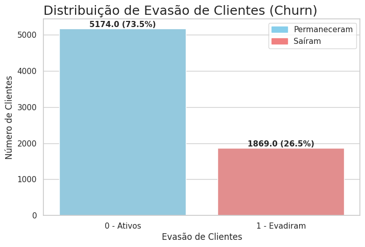

### 2.	Seção Correlação / Seleção de Features

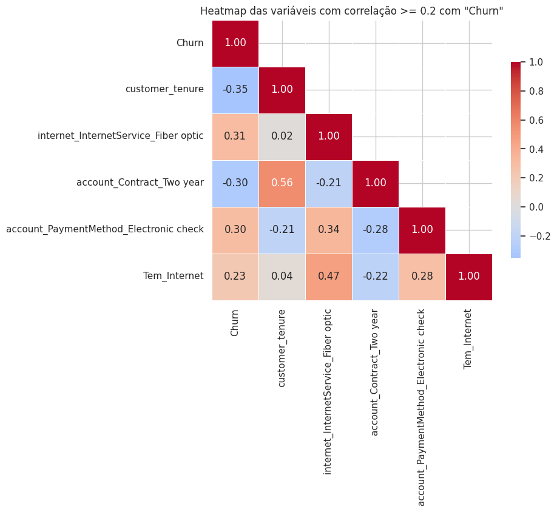

### 3.	Seção Análises Direcionadas

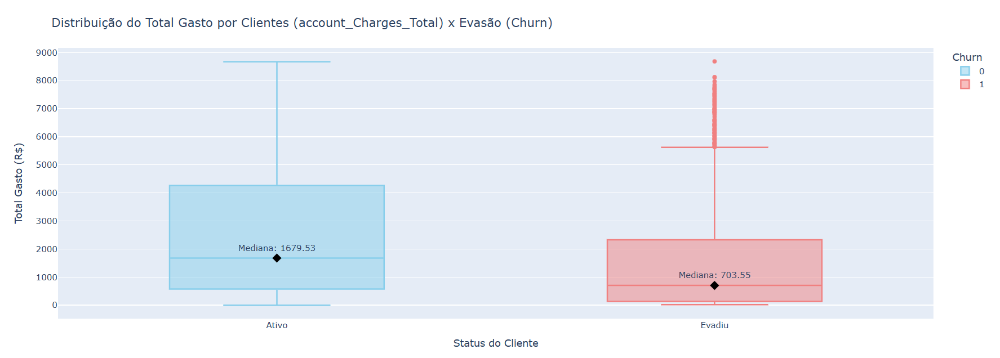

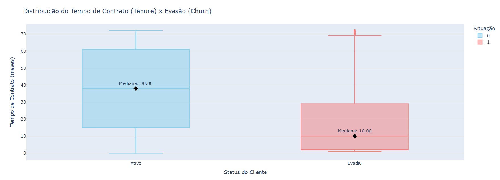

### 4.	Seção Modelagem: Curvas e Matriz

**•	Logistic Regression**

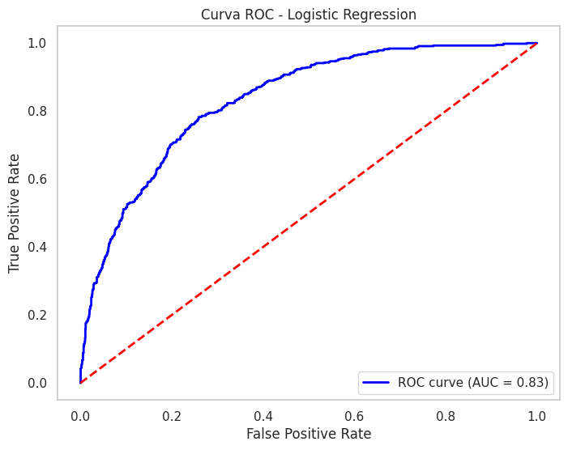

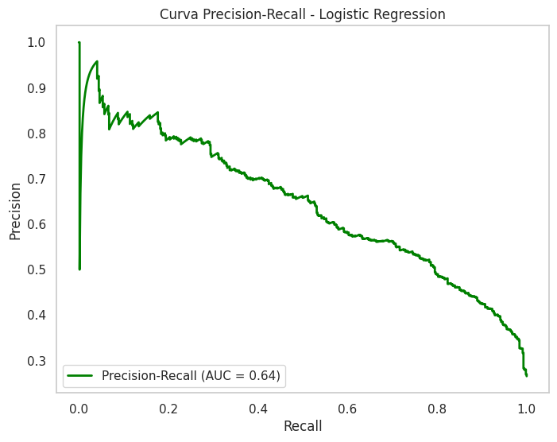

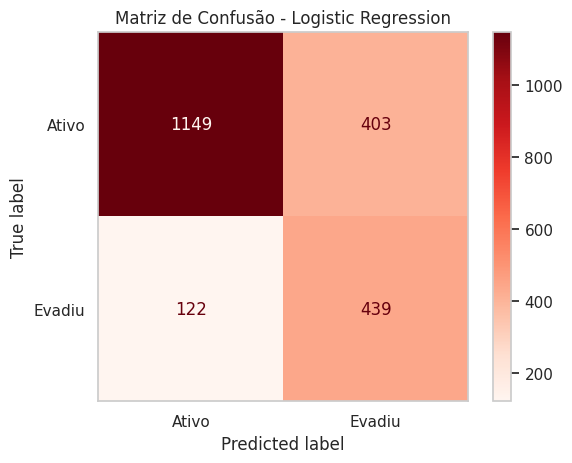

**•	Random Forest**

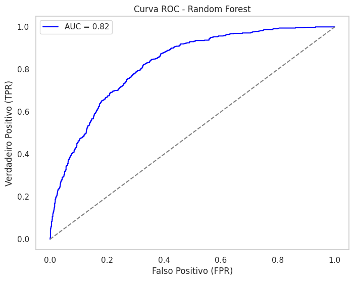

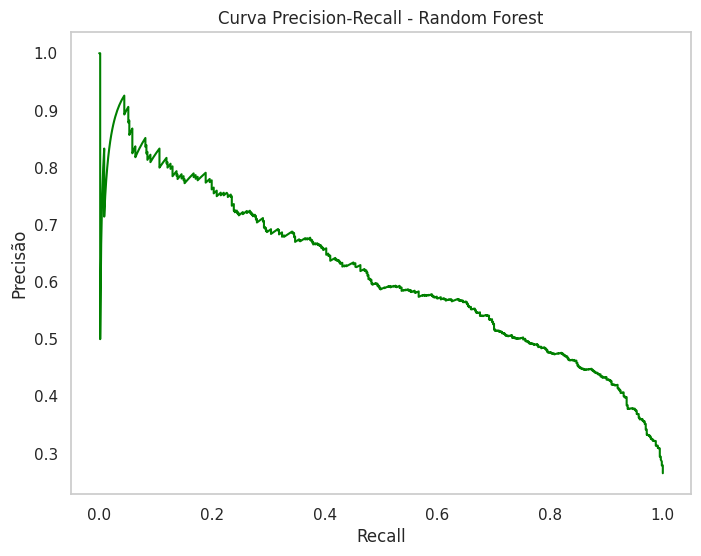

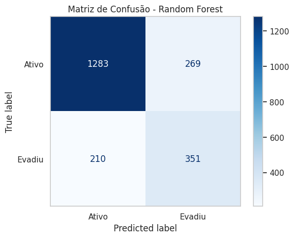

### 5.  Seção Avaliação do Modelo

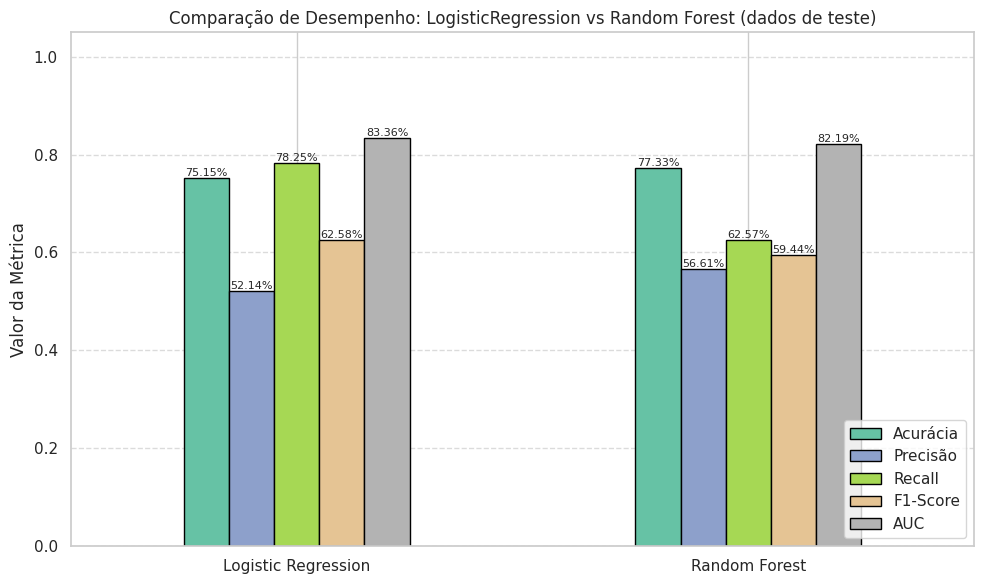

### 6.	Seção Importância das Variáveis

**•	Logistic Regression**

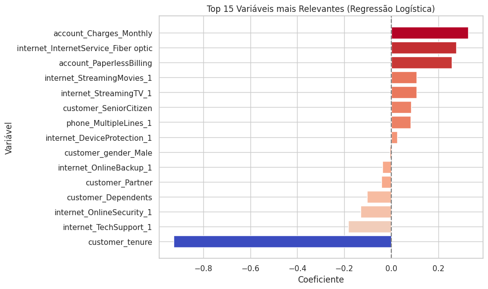

**•	Random Forest**
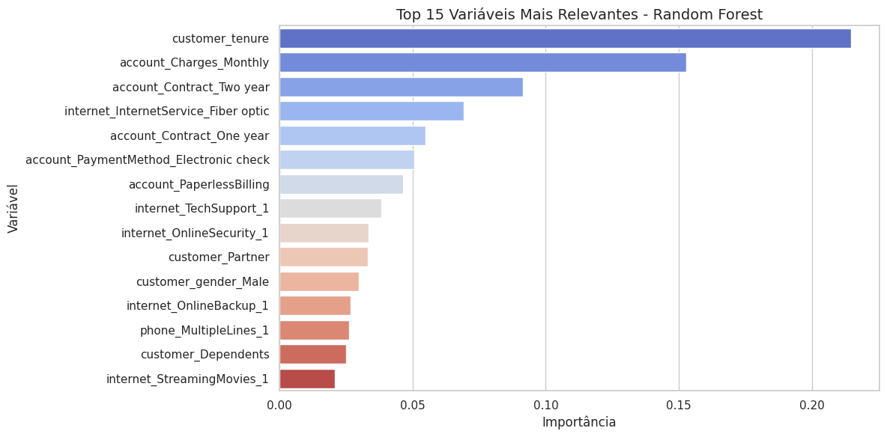

---
 

# ✅ **Conclusão Final**

A análise e a modelagem preditiva foram eficazes em extrair insights valiosos do conjunto de dados de clientes. O modelo de Regressão Logística, com seu alto recall, se mostra como a ferramenta mais adequada para identificar clientes em risco de evasão. As estratégias propostas, focadas em clientes novos, fidelização, qualidade de serviço de internet e serviços adicionais, fornecem um guia prático para ações de retenção que podem impactar diretamente os resultados da empresa.

---

### **Autor:** Raphael Bertone

[LinkedIn](https://www.linkedin.com/in/raphaelbertone/)  - 
[GiftHub](https://github.com/Raphaelbertone)
